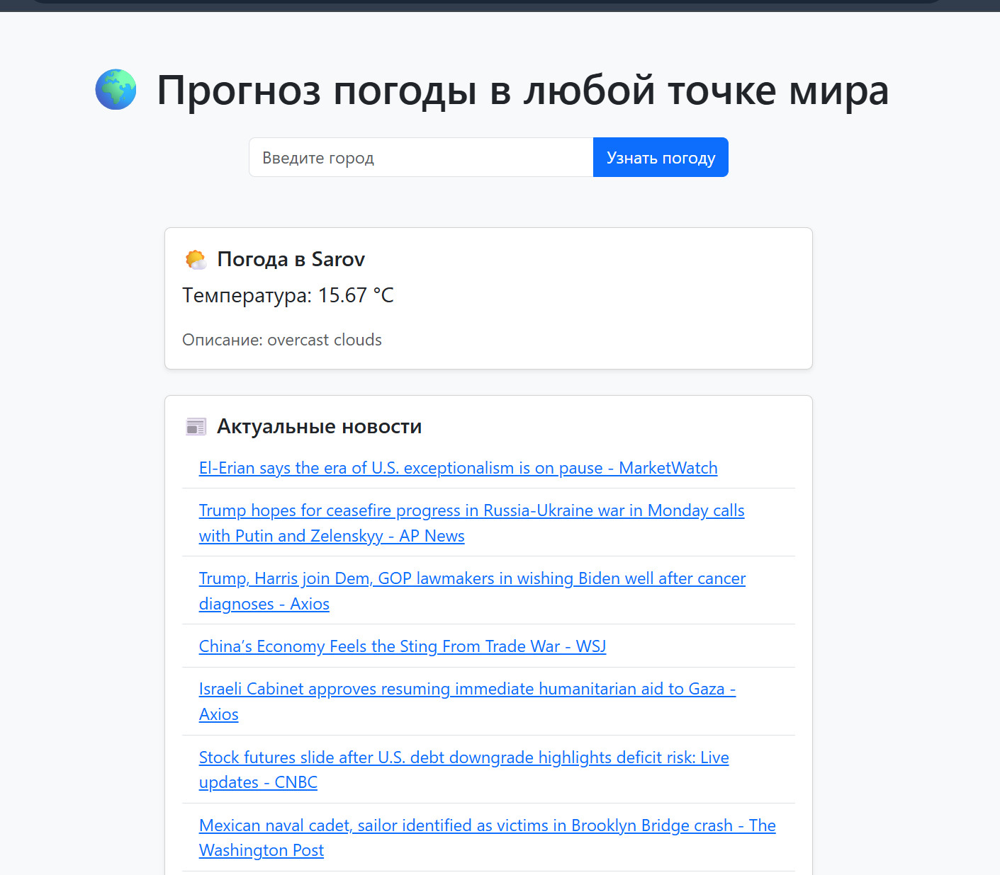

# 🌍 Прогноз погоды + Новости + Цитаты — Flask API-клиент

Это веб-приложение на Flask, которое позволяет пользователю:

- Узнать текущую погоду в любом городе мира (через OpenWeatherMap API)
- Просмотреть актуальные новости (через NewsAPI)
- Получить случайную цитату (через ZenQuotes API)
- Насладиться современным интерфейсом на Bootstrap 5



---

## 🚀 Возможности

- 🌦 Прогноз погоды по городу (температура, описание)
- 📰 Список актуальных новостей с ссылками
- 💬 Случайные цитаты на каждый запрос
- 🎨 Красивый Bootstrap-интерфейс

---

## 🧩 Технологии

- [Flask](https://flask.palletsprojects.com/)
- [requests](https://docs.python-requests.org/)
- [Jinja2](https://jinja.palletsprojects.com/)
- [Bootstrap 5](https://getbootstrap.com/)
- [ZenQuotes API](https://zenquotes.io/)
- [News API](https://newsapi.org/)
- [OpenWeatherMap API](https://openweathermap.org/api)

---

## ⚙️ Установка

### 🔧 Клонировать проект

```bash
git clone https://github.com/AlexaPan/VD08_API_class.git
cd VD08_API_class
